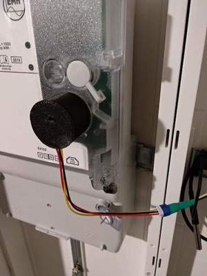
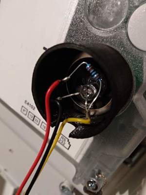
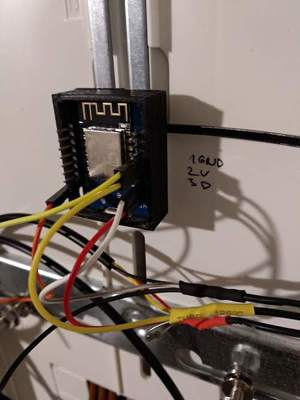

# SMLReader
ESP8266 based SmartMeter (SML) to 1-Wire gateway

## Description
The aim of this project is to read the meter readings of modern energy meters and make them available via the 1-Wire bus.

The software was primarily developed and tested for the EMH ED300L electricity meter, but should also work with other energy meters that have an optical interface and communicate via the SML protocol.

The SMLReader basically works by emulating a 1-Wire slave device, in this case a [BAE0910](http://www.brain4home.eu/downloads/BAE0910-datasheet.pdf).
Metrics that have been read from the optical unit of the meter are provided via the available 32 bit registers of the BAE0910 (`userm`, `usern`, `usero`, `userp`).

The emulation of the 1-Wire slave device is realized by the use of [OneWireHub](https://github.com/orgua/OneWireHub).

## Schematic diagram

## Hardware

### Reading head

The reading head consists of a phototransistor (BPW 40) and a 1 kΩ pull-up resistor connected to one of the GPIO pins of the microcontroller.
Other phototransistors and the use of an internal pull-up resistor will probably work, too, but I have not test it so far.

The housing of my reading head has been 3D-printed using the [STL files](http://www.stefan-weigert.de/php_loader/sml.php) from [Stefan Weigert](http://www.stefan-weigert.de). 

A ring magnet (in my case dimensioned 27x21x3mm) ensures that the reading head keeps stuck on the meter.

The phototransistor has been fixed with hot glue within the housing.

 

### Microcontroller

## Software

### Customization

### Build

### Installation

## Usage
