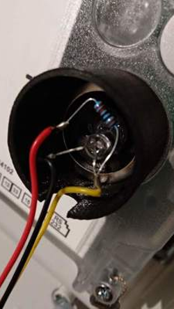

# SMLReader

A smart meter (SML) to MQTT (or 1-Wire) gateway

## Documentation

This documentation is a work in progress.  
The previous version can be found [here](doc/old/README.md).

## About

The aim of this project is to read the meter readings of modern energy meters and make them available via MQTT (or alternatively via the 1-Wire bus).

The software was primarily developed and tested for the EMH ED300L electricity meter, but should also work with other energy meters that have an optical interface and communicate via the SML protocol.

In MQTT mode the SMLReader publishes the metrics read from the optical unit of the meter to an MQTT broker that has been configured.

In 1-Wire mode the SMLReader basically works by emulating one or more 1-Wire slave device(s), in this case a [BAE0910](http://www.brain4home.eu/downloads/BAE0910-datasheet.pdf).
Metrics that have been read from the optical unit of the meter are provided via the available 32 bit registers of the BAE0910 (`userm`, `usern`, `usero`, `userp`).
The number of 1-Wire slaves that are being added to the virtual hub depends on the number of metrics.

The emulation of the 1-Wire slave device is realized by the use of [OneWireHub](https://github.com/orgua/OneWireHub).

**Note:**  
The code parts that are responsible for publishing metrics via 1-Wire are not actively maintained.  
It is likely that support for 1-Wire will be dropped in the future as it is less reliable and data cannot be transmitted as fast as with MQTT.

---

TBD.