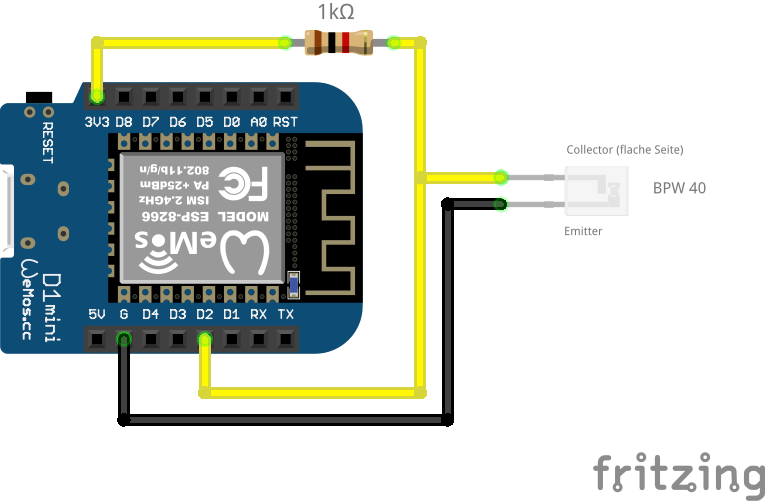

# SMLReader

A smart meter (SML) to MQTT gateway

## Documentation

This documentation is a work in progress.
The previous version can be found [here](doc/old/README.md).

## About

The aim of this project is to read the meter readings of modern energy meters and make them available via MQTT.

The software was primarily developed and tested for the EMH ED300L electricity meter, but should also work with other energy meters that have an optical interface and communicate via the SML protocol.

SMLReader publishes the metrics read from the meter's optical unit to an MQTT broker configured via the provided web interface.


**Note:**  
The code parts that are responsible for publishing metrics via 1-Wire are not actively maintained.  
It is likely that support for 1-Wire will be dropped in the future as it is less reliable and data cannot be transmitted as fast as with MQTT.

### Screenshots


### Hardware

#### Reading head

The reading head consists of a phototransistor (BPW 40) and a 1 kΩ pull-up resistor connected to one of the GPIO pins of the microcontroller.
Other phototransistors or the use of an internal pull-up resistor will probably work, too.

The housing of my reading head has been 3D-printed using the [STL files](http://www.stefan-weigert.de/php_loader/sml.php) from [Stefan Weigert](http://www.stefan-weigert.de). 

A ring magnet (in my case dimensioned 27x21x3mm) ensures that the reading head keeps stuck on the meter.

The phototransistor has been fixed with hot glue within the housing.

 

#### Schematic diagram


## Getting started

### Configuration

The configuration of the meter is done by simply editings `src/config.h` and adjusting the `metrics` variable before building and uploading SMLReader.

```c++
// EHM ED300L
static const metric METRICS[] = {
    {"power_in", {0x77, 0x07, 0x01, 0x00, 0x01, 0x08, 0x00, 0xFF}},
    {"power_out", {0x77, 0x07, 0x01, 0x00, 0x02, 0x08, 0x00, 0xFF}},
    {"power_current", {0x77, 0x07, 0x01, 0x00, 0x10, 0x07, 0x00, 0xFF}}};
```

WiFi and MQTT are configured via the web interface provided by [IotWebConf](https://github.com/prampec/IotWebConf) which can be reached after joining the WiFi network named SMLReader and heading to http://192.168.4.1.   
If the device has already been configured the web interface can be reached via your local network by using the IP it received from the DHCP server.


---

## Acknowledgements

### Third party libraries
* [FastCRC](https://github.com/FrankBoesing/FastCRC)
* [ESPSoftwareSerial](https://github.com/plerup/espsoftwareserial)
* [IotWebConf](https://github.com/prampec/IotWebConf)
* [MicroDebug](https://github.com/rlogiacco/MicroDebug)
* [MQTT](https://github.com/256dpi/arduino-mqtt)

### Links

* https://www.msxfaq.de/sonst/bastelbude/smartmeter_d0_sml_protokoll.htm
* https://www.photovoltaikforum.com/thread/78798-sml-pr%C3%BCfsummenberechnung-ich-verzweifle-an-crc/
* http://www.stefan-weigert.de/php_loader/sml.php

## Donate

<style>.bmc-button img{width: 35px !important;margin-bottom: 1px !important;box-shadow: none !important;border: none !important;vertical-align: middle !important;}.bmc-button{padding: 7px 10px 7px 10px !important;line-height: 35px !important;height:51px !important;min-width:217px !important;text-decoration: none !important;display:inline-flex !important;color:#ffffff !important;background-color:#79D6B5 !important;border-radius: 5px !important;border: 1px solid transparent !important;padding: 7px 10px 7px 10px !important;font-size: 22px !important;letter-spacing: 0.6px !important;box-shadow: 0px 1px 2px rgba(190, 190, 190, 0.5) !important;-webkit-box-shadow: 0px 1px 2px 2px rgba(190, 190, 190, 0.5) !important;margin: 0 auto !important;font-family:'Cookie', cursive !important;-webkit-box-sizing: border-box !important;box-sizing: border-box !important;-o-transition: 0.3s all linear !important;-webkit-transition: 0.3s all linear !important;-moz-transition: 0.3s all linear !important;-ms-transition: 0.3s all linear !important;transition: 0.3s all linear !important;}.bmc-button:hover, .bmc-button:active, .bmc-button:focus {-webkit-box-shadow: 0px 1px 2px 2px rgba(190, 190, 190, 0.5) !important;text-decoration: none !important;box-shadow: 0px 1px 2px 2px rgba(190, 190, 190, 0.5) !important;opacity: 0.85 !important;color:#ffffff !important;}</style><link href="https://fonts.googleapis.com/css?family=Cookie" rel="stylesheet"><a class="bmc-button" target="_blank" href="https://www.buymeacoffee.com/fkqeNT2"><span style="margin-left:15px;font-size:28px !important;">Buy me a coffee</span></a>

## License

Distributed under the GPL v3 license.  
See [LICENSE](LICENSE) for more information.
